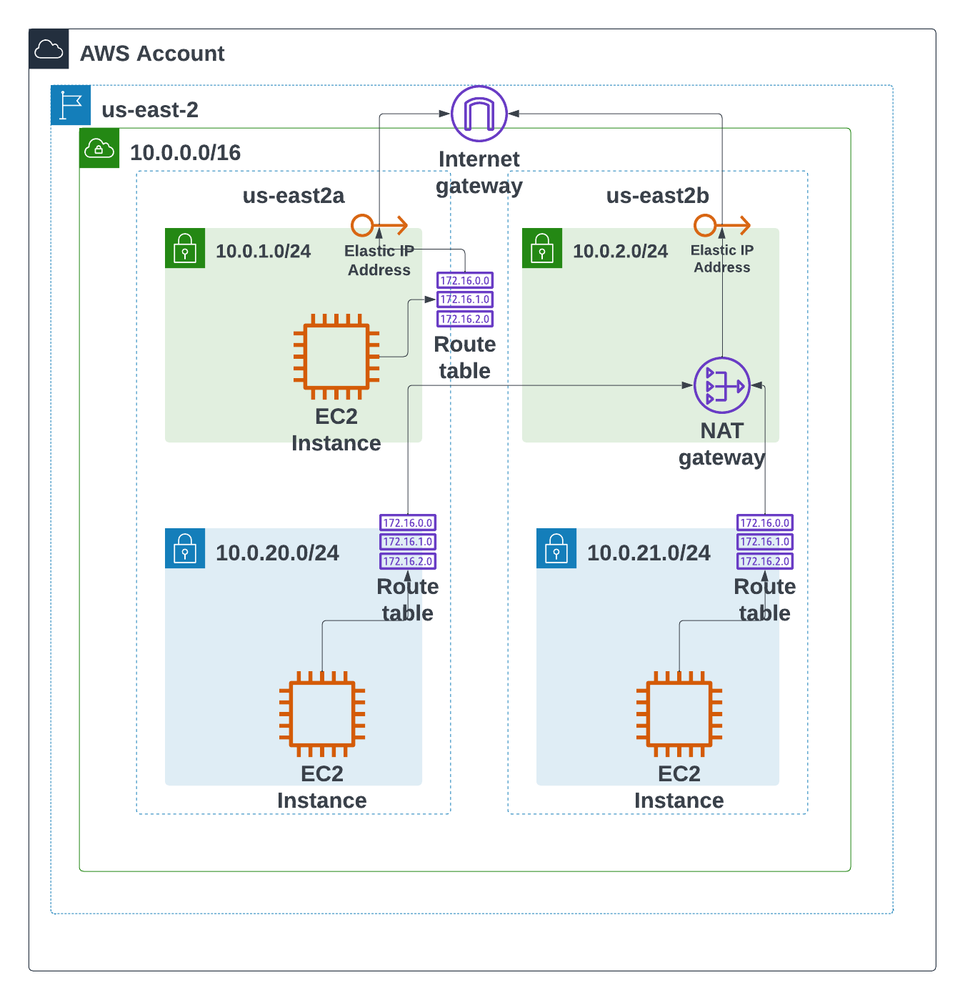

# Terraform in 21 days

## Automating AWS with Terraform

    We are using git branches to track changes.git

### 1. Get Started with Git and GitHub

+ Create a repository on GitHub: [Create a repo - GitHub Docs](https://docs.github.com/en/get-started/quickstart/create-a-repo)

+ Clone a repository: [Cloning a repository - GitHub Docs](https://docs.github.com/en/repositories/creating-and-managing-repositories/cloning-a-repository)

+ Set the name of your branchgit branch -M main

+ In your repository create the first file

    `echo "Automating AWS with Terraform" > README.md`

+ Add and commit the file

    `git add README.md`

    `git commit -m "Initial commit"`

+ Push your local changes to GitHub

    `git push origin main`

+ Create a new branch. More info about branches is here:  [About branches - GitHub Docs](https://docs.github.com/en/pull-requests/collaborating-with-pull-requests/proposing-changes-to-your-work-with-pull-requests/about-branches)

    `git checkout -b first_branch`

+ Add one more line to README.md

    `echo "We are using git branches to track changes" >> README.md`

+ Add and commit the file

    `git add README.mdgit commit -m "Update README.md"`

+ Push your local changes to GitHub (this time, we are uploading to a different branch, so the push command is different)

    `git push origin first_branch (see screenshot 1)`

+ Open GitHub in your browser. You should see two branches `main` and `first_branch`

+ Create a Pull Request. More info about pull requests is here: [About pull requests - GitHub Docs](https://docs.github.com/en/pull-requests/collaborating-with-pull-requests/proposing-changes-to-your-work-with-pull-requests/about-pull-requests)

+ Copy the Pull Request URL and send me the link

Here is an example of the repository with a similar task completed:

[Update README.md by G-oracle . Pull Request #1](https://github.com/G-oracle/terraform-in-21-days/pull/1)

### 2. Get Started with Terraform

First, we need to make sure we have terraform installed on our local environment

+ Use the following guide to install terraform in your local environment:
[Install Terraform | Terraform | HashiCorp Developer](https://learn.hashicorp.com/tutorials/terraform/install-cli)

+ Once you have terraform installed. Try deploying your first simple AWS resource (ec2 instance):
[Build Infrastructure | Terraform | HashiCorp Developer](https://learn.hashicorp.com/tutorials/terraform/aws-build)

### 3. Create a Network Diagram

It's important to have your infrastructure properly documented.

An architecture diagram will also help you to demonstrate your skills during interviews. Sometimes potential employers ask to perform a demo.

You can use tools such as [draw.io](https://draw.io) or [Lucidchart](https://lucidchart.com) or any other diagramming tool to create a network-level diagram of your solution.

See below a sample VPC architecture diagram created using [Lucidchart](https://lucidchart.com):

### 4. Deploy VPC using Terraform

Create a terraform template for AWS VPC (as depicted by our Network diagram above). We will use this VPC later for running our workloads
A template should contain the following resources:

    - VPC

    - At least two public subnets

    - At least two private subnets

    - Internet gateway

    - At least two NAT gateways

    - Public route table

    - Private route table

***You should be able to launch a virtual machine in a private subnet, establish an SSH connection to it, and download updates from the internet.***
